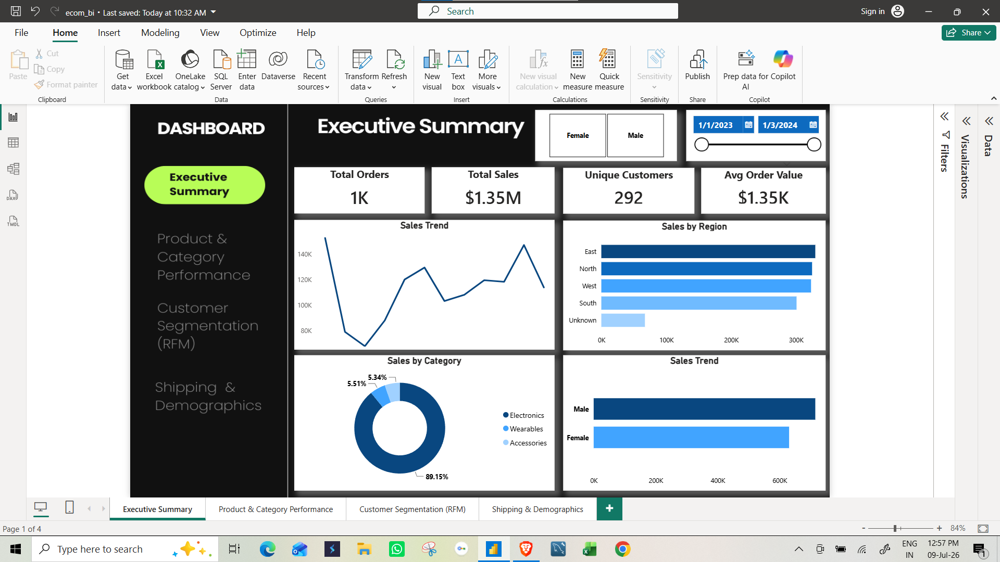
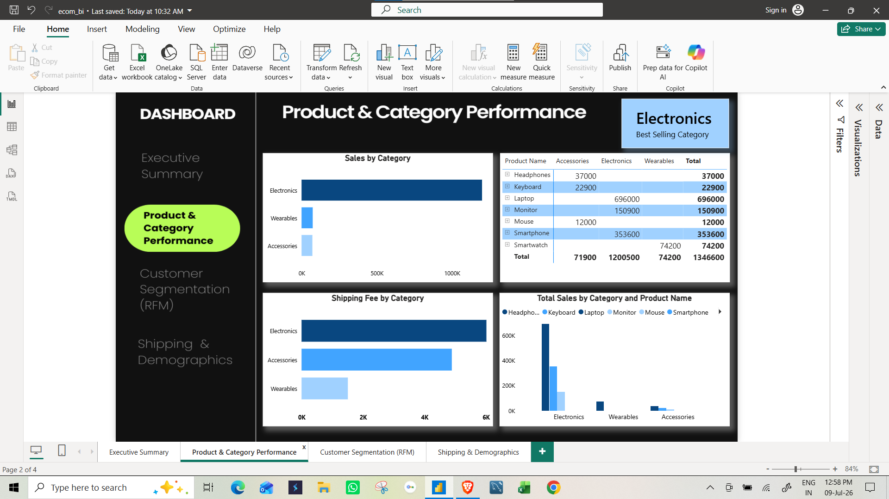
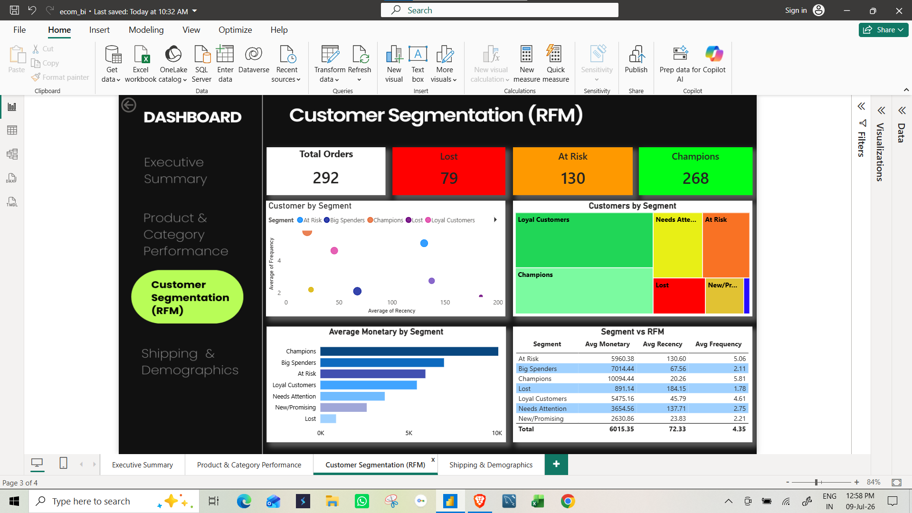
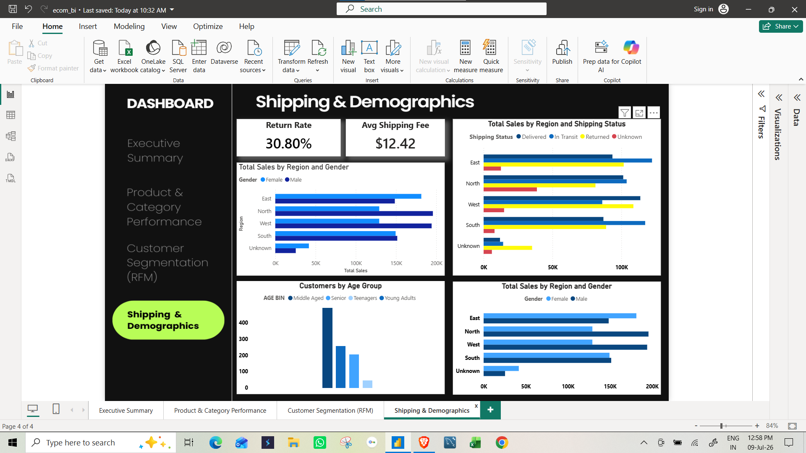

# 🛒 E-commerce Sales & Customer Segmentation Dashboard

An end-to-end data analytics project that cleans raw e-commerce order data, builds an RFM (Recency, Frequency, Monetary) customer segmentation model in Python, and visualizes business performance through an interactive Power BI dashboard.

---

## 📌 Project Overview

This project analyzes 1,000+ e-commerce orders across 292 unique customers to answer key business questions:
- What are our sales and revenue trends over time?
- Which products and categories drive the most revenue?
- Who are our most valuable customers, and which ones are at risk of churn?
- How are shipping performance and demographics distributed?

---

## 🧹 Data Cleaning & Preprocessing (Python / Pandas)

- Handled missing values across `Region`, `Age`, and `Shipping Status` using appropriate strategies:
  - `Age` → filled with **median** (robust to outliers)
  - `Region` & `Shipping Status` → filled with **"Unknown"** (avoids distorting return-rate and regional metrics via mode imputation)
- Identified and corrected a **currency-conversion inconsistency** affecting ~2% of records, where `Unit Price` didn't reconcile with `Total Price` — recalculated `Unit Price = Total Price / Quantity` for affected rows
- Converted and validated `Order Date` formatting for time-series analysis

## 🧮 RFM Customer Segmentation (Python)

Built a full RFM model from scratch:
- **Recency** — days since each customer's last order
- **Frequency** — total number of orders per customer
- **Monetary** — total amount spent per customer

Each metric was scored 1–5 using quantile-based scoring (`pd.qcut`), then combined into **7 customer segments**:

| Segment | Description |
|---|---|
| Champions | Recent, frequent, high-spending customers |
| Loyal Customers | Consistent repeat buyers |
| Big Spenders | High value, less frequent |
| New/Promising | Recent but low frequency |
| At Risk | Previously frequent, now inactive |
| Needs Attention | Middling across all metrics |
| Lost | Long inactive, low value |

## 📊 Power BI Dashboard

A 4-page interactive dashboard built on the cleaned dataset:

1. **Executive Summary** — Total Sales, Orders, Unique Customers, AOV; sales trend, sales by region/category/gender
2. **Product & Category Performance** — revenue by category, top product table, price-vs-volume scatter
3. **Customer Segmentation (RFM)** — segment treemap, Recency-vs-Frequency scatter (sized by Monetary), segment summary table
4. **Shipping & Demographics** — return rate, shipping status breakdown, sales by region/gender/age

**10+ custom DAX measures** were written, including:
- Dynamic Top-N logic (e.g., `Best Selling Category`)
- Distinct-count customer metrics to avoid double-counting at order-level granularity
- De-duplicated averages for RFM fields (repeated across each customer's orders)

## 🔑 Key Insights

- **26%** of customers are Loyal, **17%** are Champions — a healthy core customer base
- **17%** of customers are classified as Lost, representing a re-engagement opportunity
- Identified a small but high-value **"Big Spenders"** segment (low frequency, high spend) — a clear upsell target

## 🛠️ Tools Used
- **Python (Pandas)** — data cleaning, RFM modeling
- **Power BI** — dashboard design, DAX measures, data visualization

## 📁 Repository Structure
```
├── clean_data.csv          # Cleaned dataset with RFM fields merged in
├── rfm_analysis.ipynb      # Python notebook: cleaning + RFM segmentation
├── dashboard.pbix          # Power BI dashboard file
├── screenshots/            # Dashboard page screenshots
└── README.md
```

## 📷 Dashboard Preview





---

**Author:** Mo Talha Khan
